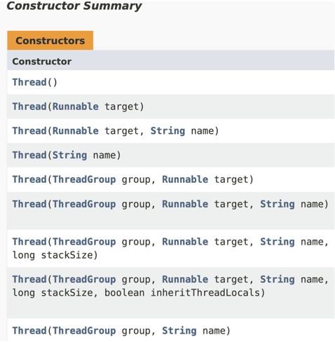
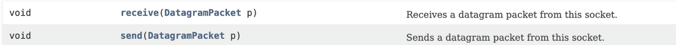

# 목적

- 자바의 기본기를 다지자
- 자바의 신 책을 읽고 공부 내용 기록하기
- 읽고 나만의 언어로 정리하기

<details> 

<summary><h2> Chapter 1. 프로그래밍이란 무엇인가? </h2></summary>

- 클래스가 뭔가요?

클래스는 객체들의 정보를 갖고 있습니다. 클래스는 자바에서 가장 작은 단위로 상태와 행위를 보통 갖고 있습니다.

- 메소드가 뭔가요?

클래스 내에 행위를 정의하는 것입니다.

- 메소드의 매개 변수는 어디에 적어주나요?

메서드명 옆에 소괄호 안에 적어줍니다.

- 메소드 이름 앞에 꼭 적어 적어 줘야 하는 건 뭐죠?

반환 타입 입니다. int, String, 객체명 등이 있습니다.

- 클래스가 갖고 있어야 한다고 한 두가지가 뭐죠?

상태인 변수(들)과 행위인 메서드(들) 입니다.

- 메소드에서 결과를 돌려주려면 어떤 예약어를 사용해야 하나요?

return 변수명 혹은 식 을 통해 돌려줍니다. 다만 void일 경우 반환 값이 없는 것이기 때문에 return을 적지 않습니다.

</details>

<details>

<summary><h2>Chapter 2. HelloGodOfJava</h2></summary>

- main() 메소드의 메소드 이름 앞에는 어떤 예약어들이 들어 가나요? (순서대로 쓰세요)

public static void

- main() 메소드의 매개변수에는 어떤 값이 들어가나요?

(Strings[] args)

- 만약 여러분들이 만든 클래스에 main() 메소드가 없다면, java 명령어로 그 클래스를 수행할 수 있나요?

아니요

- System.out.println() 메소드는 어떤 용도로 사용하나요?

콘솔에 출력하기 위해 사용합니다.

- System.out.print() 메소드는 System.out.println() 메소드와 어떤 차이가 있나요?

println은 마지막에 \n 이 포함되어 있으며 println() 메서드가 여러개 enter누른것처럼 콘솔에 출력되지만, print()는 여러개가 있어도 콘솔에 한줄로 출력됩니다.

- // 는 무엇을 하는데 사용하는 기호인가요?

한줄 주석

- /* 로 시작하고, */로 끝나는 사이에 있는 소스들을 어떻게 되나요?

/*으로 시작하여 */으로 끝나는 주석은 블록 주석으로, 해당 블록 내의 모든 내용은 무시된다.

- 메소드를 선언할 때 반드시 꼭 있어야 하는 세가지는 무엇인가요?

리턴 타입, 메소드 이름, 메소드 내용

</details>

<details>

<summary><h2>Chapter 3. 자바를 제대로 알려면 객체가 무엇인지를 알아야해요</h2></summary>
- 클래스와 객체의 차이점을 말해 주세요

클래스는 청사진으로 자바에서 가장 작은 단위입니다. 이 클래스를 new 생성자를 통해 생성한 것을 객체라고 합니다.

- 객체를 생성하기 위해서 꼭 사용해야 하는 예약어는 뭐라고 했죠?

new 생성자

- 객체를 생성하기 위해서 사용하는 메소드 같이 생긴 클래스 이름에 소괄호가 있는 것을 뭐라고 하나요?

기본 생성자

- 메소드를 사용하기 위해서는 어떤 것을 만들어야 하나요?

객체

- 객체를 만드려면 어떤 예약어를 사용하고, 클래스의 무엇을 사용해야 하나요?

객체를 만들려면 new 생성자를 사용해야하고, 클래스에서 생성자 함수를 만들어야 합니다.
</details>

<details>

<summary><h2>Chapter 4. 정보를 어디에 넣고 싶은데</h2></summary>

<h3> 변수의 종류</h3>

- 지역 변수 → 메소드 내의 변수들(중괄호 내의 변수) → 지역 변수를 선언한 중괄호 내에서만 유효함
- 매개 변수 → 파라미터, 메소드에 넘겨주는 변수들(소괄호 내의 변수)
- 인스턴스 변수 → 클래스 내에 있지만 메소드 밖에 있는 변수들. (단 static이 없어야함)
- 클래스 변수 → 인스턴수 변수 앞에 static이 붙으면 클래스 변수

<h3>변수 명을 왜 나눌까?</h3>

위 네 개의 변수의 사용 용도가 다르고, 생명 주기가 다름

<h3>기본자료형</h3>

- 슷자형
    - 정수형 - byte(1), short(2), int(4), long(8), **char**
    - 소수형 - float(4), double(8)
- boolean

byte 타입은 왜 만들었을까요? → 데이터를 저장할 때, byte 값들을 조합해서 적은 공간에 보다 많은 내용을 저장하기 위해

byte : -128~127

정수형 이진법의 맨 앞은 양수와 음수를 나누기 위해 사용

맨 앞이 0이면 양수, 1이면 음수

|  | 2^6 | 2^5 | 2^4 | 2^3 | 2^2 | 2^1 | 2^0 | 결과값 |
| --- | --- | --- | --- | --- | --- | --- | --- | --- |
| byteMin | 1 | 0 | 0 | 0 | 0 | 0 | 0 | -128 |
| byteMax | 0 | 1 | 1 | 1 | 1 | 1 | 1 | 127 |

```java
Byte byteMin=-128;
        Byte byteMax=127;
        System.out.println("byteMin = "+byteMin); // - 128
        System.out.println("byteMax = "+byteMax); // 127

        byteMin--;
        byteMax++;
        System.out.println("byteMin = "+byteMin); // 127
        System.out.println("byteMax = "+byteMax); // -128
```

byteMin의 값을 2진수로 표현하면 1000_0000 에서 1을 뺀다면 0111_1111이 되고,

byteMax의 값을 2진수로 표현하면 0111_1111 에서 1을 더하면 1000_0000이 된다.

1 bit == 1자리

float(4byte) → 부호(1bit) + 지수(8bit) + 가수(23bit) = 32bit

double(8byte) → 부호(1bit) + 지수(11bit) + 가수(52bit) = 64bit

char 정의하는 방법 3가지 !! char는 unsigned이므로 음수를 저장하지 못함

- 알파벳 혹은 한글로 정의 → char case1 = ‘a’;
- 유니코드로 정의 → char case2 = ‘\u0097’
- 0~65535 안에서 숫자로 정의 → char case3 = ‘9100’

기본 자료형의 값을 할당하지 않으면? → 변수를 초기화할 때, 기본값으로 할당되어 있음. 단, 지역 변수로 사용할 경우 변수에 값을 할당하지 않으면 컴파일 되지 않음.
정수형의 기본값은 0임. 단 char는 \u0000 으로 빈칸임. boolean 기본값은 false

- 네가지 종류 변수는 어떻게 구분할 수 있나요?

변수 선언 위치에 지역 변수, 매개 변수, 인스턴스 변수를 구분하고, 인스턴스 변수 앞에 static을 선언하면 클래스 변수가 됩니다.

- int or long 자료형을 사용하면 되는데 byte 타입은 왜 만들었을까요?

byte 타입을 활용해서 동영상이나 이미지 저장을 할 때, 적은 공간에 보다 많은 내용을 저장할 수 있습니다.
</details>

<details>
<summary><h2>Chapter 5. 계산을 하고 싶어요</h2></summary>


소수형은 비트 연산이 불가능

A & B → 두 값이 모두 true여야 true 반환

A | B → 두 값이 모두 false여야 false 반환

A^B → 두 값이 달라야 true 반환

A조건 && B 조건이 있을 때, A조건이 false일 경우 B조건은 연산을 수행하지 않고 false 반환

모든 참조 자료형은 +연산만 가능. 해당 클래스에 있는 toString 메소드의 결과에 +연산을 하는 것

기본자료형 형 변환(casting)

* 작은 타입에서 큰 타입으로 형 변환할 때, 캐스팅해줄 필요가 없음
* 큰 타입에서 작은 타입으로 형 변환할 때, 명시적으로 캐스팅을 해주어야 함.
* 단, 큰 타입에서 작은 타입으로 형 변환할 때는 예상치 못한 값이 올 수도 있다.
  (ex. short shortValue = 256 → shortValue = (byte) 256 → shortValue의 값은 0이 나옴

❗️ 실제 돈을 계산하는 부분을 계산할 때에는 double이나 float을 절대 사용해서 안된다. 이런 중요한 계산이 필요할 때 BigDecimal이라는 클래스를 사용해야 한다.

</details>

<details>

<summary><h2>Chapter 6. 제가 조건을 좀 따져요</h2></summary>

switch 문장에서는 한번 조건을 만족시켜 줬다면, 그 다음 break가 올 때 까지, 어떤 case가 오든 상관 안하고 계속 무사 퉁과시킨다.

- 왜 이렇게 break를 쓰게 했을까?

비교 대상이 값에 범위에 있다면 if를 사용하겠지만, 특정 조건에 따른 처리를 해야 할 경우에는 switch문을 사용하면 좋다.

ex) 달력

```java
public class Calender {
    public void switchCalender(int month) {
        switch (month) {
            case 1:
            case 3:
            case
            case 5:
            case 7:
            case 8:
            case 10:
            case 12:
                System.out.println(month + " has 31 days");
                break;
            case 4:
            case 6:
            case 9:
            case 11:
                System.out.println(month + " has 01 days");
                break;
            case 2:
                System.out.println(month + " has 28 or 29 days");
                break;
            default
                ;
                System.out.println(month + " is not a month");
        }
    }
}
```

- 보통 default를 마지막에 두는데 꼭 마지막에 둬야 하나요?

문법상 정해진 것은 없지만, default를 중간에 둘 경우 원하지 않는 결과가 나올 수 있기에 마지막에 두는 것을 권장함.

switch를 통해 숫자를 비교할 때, 적은 숫자부터 증가시켜주는 것을 권장함.

반복문에서 continue와 break;

continue는 반복문 중괄호 시작으로 돌아감. 즉, 반복문 내에서 continue 하위의 부분을 생략

break는 반복문을 종료시킴 반복문의 마지막 중괄호 밖으로 나감.

</details>

<details>

<summary><h2>Chapter 7. 여러 데이터를 하나에 넣을 수는 없을까요?</h2></summary>

배열은 무조건 선언할 때 크기가 지정되어야 함. 이러한 단점을 보완한 것이 Collections임

배열을 선언한 후 출력하면 “타입이름@고유번호”순으로 출력된다. toString()이라는 메소드를 만들어주면 배열의 값들 출력 가능

[Ljava.lang.String.@1304e18c]

- [L : 가장 앞으로 “[”는 배열을 의미하며, L은 해당 배열은 참조 자료형이라는 의미
- java.lang.String : 해당 배열이 어떤 타입의 배열인지를 알려줌
- @1304e18c : 해당 배열의 고유 번호

참조 자료형 배열의 각각의 값은 초기화하지 않으면 null이 된다.

</details>

<details>

<summary><h2>Chapter 8. 참조 자료형에 대해서 더 자세히 알아봅시다</h2></summary>

* 참조자료형과 기본자료형의 차이는?
  참조 자료형은 new를 사용해서 객체를 생성해야 한다.(String 제외)

"+" 연산은 참조 자료형 중에서 String 클래스만 사용 가능하고 나머지는 클래스에서 사용할 수 없다.
다른 참조형이 사용할 수 있는 연산자는 값을 할당하기 위한 등호 오직 "=" 뿐이다.

기본 생성자는 자바에서 자동으로 만들어 준다. 하지만 다른 파라미터를 포함한 생성자를 만들어 둘 경우 기본 생성자는 자동으로 만들어지지 않기 때문에, 명시적으로 만들어 두어야 한다.

* 생성자는 왜 필요할까?
  이름에서 알 수 있듯이 객체를 생성하여 사용하기 위해 꼭 필요한 것이다. 객체를 생성하는 곳은 객체를 설계느느 클래스 내부가 아닌 다른 메서드(main 같은)의 내부이기 때문이다.

생성자를 클래스 내에 만들 때, 다른 메소드 아래 두어도 상관은 없지만, 암묵적인 약속 하에 필드, 생성자, 메소드 순으로 정의한다.

* Dto를 만들면 무슨 장점이 있을까? (아키텍처 관점 말고 자바 관점에서 생각해보자)

자바의 메서드를 선언할 때, 리턴 타입은 최대 한가지 이다. 즉, 복합적인 데이터를 리턴하려면 두 가지 방식이 있다. 여러 개의 데이터를 넣은 배열(or Collections)과 참조 자료형(객체)이다.
복합적인 데이터가 각각 다른 타입이라면 선택지는 객체를 만드는 것밖에 없다. 이렇게 만든 객체(0000DTO)가 리턴타입이 된다.

<h3>메소드 overloading</h3>
클래스의 생성자는 파라미터들을 서로 다르게 하여 선언이 가능하며 이는 메서드 오버로딩의 대표적인 예시 이다.
메소드 오버로딩은 메서드 이름만 같도록 하고, 파라미터만 다르게 하는 것을 의미한다.
(단, 파라미터의 타입과 개수가 같지만 파라미터의 이만 다르다면 같은 메소드로 인식한다.)

* 왜 메소드 오버로딩을 사용할까?

같은 역할을 하는 메소드는 같은 메소드 이름을 가져야 하지만, 파라미터가 다를 수 있기 때문이다. 예를 들어, System.out.println()을 할 때, 소 괄호 안에 인자가 달라도 그대로 출력이 되는 것은
메소드 오버로딩이 되어 있기 때문이다.
만약, 오버로딩이 불가하다면 printlnInt(), printlnLong() 등 이렇게 표현해야 하기에 더 불편하다.

* 메서드를 정의할 때, 리턴 뒤에 다른 구문을 넣으면 어떻게 될까?

```java
    pubic String getName(){
        String name="heo";
        return name;
        name+="king";
        }
```

unreachable statement 에러가 발생한다. 즉, 리턴 문장 이후 어떤 문장도 있으면 안된다.

* if문 안에 리턴 문장이 있을 경우

if문 안에 리턴 문장이 있을 경우, if 밖에 혹은 else구문을 통해 리턴을 만들어 두어야 한다. 보통 전자가 깔끔하다.

```java
    public String getSocialLogin(String providerId){
        if(providerId=="kakao"){
        return"kakao";
        }
        return"naver";
        }
```

<h3>static 메서드와 일반 메소드의 차이

static 메서드 안에서 변수를 활용하려면 static을 선언한 변수여야 한다.
(static은 클래스 변수를 사용하기 때문.)

객체는 여러개 생성하지만, 한 번만 호출되어야 하는 코드가 있다면 "static 블록"을 사용한다.

<h3><Pass by value, Pass by reference></h3>

Pass by value : 값만 전달한다 -> 호출되기 전과 후에 데이터가 변경되지 않음
Pass by reference : 값이 아닌 객체의 참조를 전달한다-> 호출한 메소드의 데이터에도 영향을 줌

기본 자료형은 **무조건** **"Pass By value"** 로 데이터를 전달한다.
참조 자료형은 **"Pass By reference"** 로 데이터를 전달한다.

```java
public class Reference {
    public void callPassByValue() {
        int a = 100;
        String b = "b";
        System.out.println("before passByValue");
        System.out.println("a = " + a);
        System.out.println("b = " + b);
        passByValue(a, b);
        System.out.println("after passByValue");
        System.out.println("a = " + a);
        System.out.println("b = " + b);
    }

    public void passByValue(int a, String b) {
        a = 1000;
        b = "change";
        System.out.println("in passByValue");
        System.out.println("a = " + a);
        System.out.println("b = " + b);
    }

    public void callByReference() {
        MemberDto member = new MemberDto("wonrok", 20);
        System.out.println("before passByReference");
        System.out.println("member = " + member);
        passByReference(member);
        System.out.println("after passByReference");
        System.out.println("member = " + member);
    }

    public void passByReference(MemberDto member) {
        member.setName("rokwon");
        member.setAge(27);
    }

    public static void main(String[] args) {
        Reference reference = new Reference();
        reference.callPassByValue();
        /*
        before passByValue
        a = 100
        b = b
        in passByValue
        a = 1000
        b = change
        after passByValue
        a = 100
        b = b
        */
        reference.callByReference();
        /*
        before passByReference
        member = MemberDto{name='wonrok', age=20}
        after passByReference
        member = MemberDto{name='rokwon', age=27}
         */
    }
}

```

pass by value는 값을 전달하는 작업이고, 호출되기 전과 후에 데이터가 변경되지 않는다.
-> 모든 기본 자료형은 pass by value이다.
pass by reference는 값이 전달되면, 호출한 메소드의 데이터에도 영향이 있다.
-> 참조자료형은 값이 아닌 참조가 전달되는 pass by reference이다.

파라미터를 여러개 넣어 주는 신기한 방법

```java
public void getMemberName(String...names){...}
```

</details>

<details>

<summary><h2>Chapter 9. 자바를 배우면 패키지와 접근제어자는 꼭 알아야 해요</h2></summary>

### 패키지의 제약사항

- 소스의 가장 첫 줄에 있어야만 한다.
- 패키지 선언은 소스 하나에는 하나만 있어야 한다.
- 패키지 이름과 위치한 폴더 이름이 같아야 한다.
- 패키지 이름을 java로 시작해서는 안된다. → Prohibited package name 에러 메세지

### 패키지 이름을 지정할 때 유의점

- 패키지 이름은 모두 소문자로 지정해야 한닫는 약속
- 자바의 예약어를 사용해서는 안됨
  ex) int, static

### 접근 제어자

- public : 누구나 접근 가능
- protected : 같은 패키지 내 or 상속받은 경우 가능
- package-priavte(default) : 같은 패키지 내 접근 가능
- private : 해당 클래스만 접근 가능

</details>

<details>

<summary><h2>Chapter 10. 자바는 상속이라는 것이 있어요</h2></summary>

## 상속

자식 클래스의 생성자가 호출되면, 자동으로 부모 클래스의 매개 변수 없는 생성자가 실행됨

super()을 사용하면 부모 클래스의 생성자를 호출한다는 것을 의미한다.

자바는 부모의 매개변수가 없는 기본 생성자를 찾는 것이 기본이기에, 부머 클래스에 매개 변수가 있는 생성자만 있을 경우에는 super()을 이용해서 부모 생성자를 꼭 호출해야 한다.

## 메소드 오버라이딩(Overriding)

- 메소드 오버라이딩은 부모 클래스의 메소드와 동일한 시그니처를 갖는 자식 클래스의 메소드를 재정의할 때 사용함
- 자식 클래스 생성자는 부모 클래스의 디폴트 생성자를 찾지만, 오버라이딩 된 메소드는 재정의한 메소드만 호출함
- 오버라이딩 된 메소드는 부모 클래스와 동일한 리턴 타입을 가져야 함.
- 오버라이딩 된 메소드의 접근 제어자는 부모 클래스에 있는 메소드와 달라도 되지만, 접근 권한이 확장된 경우에만 허용되고, 축소될 경우 컴파일 에러가 발생함.
  (public > protect > packge-private > private, 오른쪽으로 갈수록 축소됨)

만약 자식 클래스에서 리턴 타입을 바꾼다면 “return type String is not compatible with void” 에러를 만난다. 부모클래는 void인데 자식클래스에서 String을 리턴했다고
알려주며 에러를 알려준다.

### 형 변환(casting)

참조 자료형은 자식 클래스의 타입을 부모 클래스의 타입으로 형 변환하면 부모 클래스에서 호출할 수 있는 메소드들은 자식 클래스에서도 호출할 수 있으므로 전혀 문제가 안되기에 형 변환을 명시적으로 해줄 필요가 없다.

자식 클래스를 부모 클래스로 형 변환은 보통 안되지만 예외사항이 1개 있다.

자식 타입으로 선언한 변수를 부모 타입으로 업캐스팅을 한 경우, 이 변수는 다시 자식 타입으로 다운캐스팅이 가능하다.

instancof를 활용하여 객체의 타입을 확인할 수 있으며, 조건절로 확인을 할 때는 가장 하위에 있는 자식 타입부터 확인해야 한다.(부모 타입도 true라는 결과를 제공하기 때문)

### 다형성

(형 변환을 하더라도, 실제 호출되는 것은 원래 객체에 있는 메소드가 호출된다)
<br></br>
하나의 인터페이스나 클래스를 여러 가지 타입으로 사용할 수 있는 능력을 의미합니다. 다형성을 이용하면 동일한 코드를 사용하여 다양한 객체를 처리할 수 있으며, 코드의 재사용성과 유연성을 높일 수 있습니다.

</details>

<details>

<summary><h2>Chapter 12. 모든 클래스의 부모는 Object에요</h2></summary>

아무런 상속을 받지 않는다면, Obejct 클래스를 상속받은 것이다.

자바는 다중 상속을 받을 수는 없지만, 여러 단계로 상속을 받을 수는 있다.

## 왜 Object를 상속하도록 했을까?

‘클래스라면 이정도의 메서드는 있어야지’ 인 것 같다.
ex) toString(), equals(), hasCode, getClass()

**equals() 메소드를 오버라이딩 할 때에는 hashCode() 메소드도 같이 오버라이딩 해야 한다는 것이다. equlas()를 통해 객체가 서로 같다고 이야기 할 수는 있지만, 그 값이 같다고 해서 그 객체의 메모리 주소값이 같지는 않다. 같은 hashCode() 메소드 결과를 갖도록 hashCode() 메소드도 재정의 해줘야 한다.**

hascode() 메소드는 기본적으로 객체의 메모리 주소를 16진수로 리턴한다.

만약 두 객체가 동일하다면 hashCode() 값은 무조건 동일해야 한다.

자바 API 문서에서는 hashCode() 메소드를 재정의할 때 다음과 같은 조건을 따라야 한다고 명시했다.

- 자바 애플리케이션이 수행되는 동안 어떤 객체에 대해 이 메소드가 호출될 때에는 항상 동일한 int 값을 리턴해 주어야 한다.(단, 자바를 실행할 때마다 같은 값일 필요는 없다.)
- 어떤 두 객체에 대하여 equlas() 메소드를 사용하여 비교한 결과 true라면, 두 객체의 hashCode() 메소드를 호출하면 동일한 int값을 리턴해야 한다.
- 두 객체를 equals() 메소드를 사용하여 비교한 결과 false를 리턴했다고 해서, hashCode() 메소드를 호출한 int 값이 무조건 다를 필요는 없다. 하지만, 이 경우에 서로 다른 int 값을 제공하면 hashtable의 성능을 향상시키는데 도움이 된다.

[equlas()와 hashCode()](https://velog.io/@wlsgur1533/equals%EC%99%80-hashCode)

</details>

<details>

<summary><h2>Chapter 13. 인터페이스와 추상클래스, enum</h2></summary>

방법론

- 분석
- 설계
- 개발 및 테스트
- 시스템 릴리즈

## 인터페이스와 추상클래스

인터페이스와 abstract 클래스를 사용하는 이유

- 설계시 선언해 두면 개발할 때 기능 구현에만 집줄할 수 있음
- 개발자의 역량에 따른 메소드의 이름과 매개 변수 선언의 격차를 줄일 수 있음
- 공통적인 인터페이스와 abstract 클래스를 선언해 놓으면, 선언과 구현을 분리할 수 있음.

설계 단계에서 인터페이스만 만들어 놓고, 개발 단계에서 실제 작업을 수행하는 메소드를 만들면 설계 단계의 산출물과 개발 단계의 산출물이 보다 효율적으로 관리됨.

abstact 클래스는 내부에 abstac로 선언된 메소드가 0개 이상 있으면 된다.

abstact로 선언된 메소드가 1개 이상이라면 클래스명 앞에 abstact를 선언해줘야 한다.

### final

final의 역할은 두 가지 있음

- final 변수 : 더 이상 바꿀 수 없다.
- final 메소드 : 더 이상 오버라이딩 할 수 없다.
- 클래스 :  더 이상 상속받을 수 없다. (ex. String)

인터페이스 내부에 final 메소드 선언은 불가함.

## enum 클래스라는 상수의 집합

enum을 선언하면 ‘이 객체는 상수의 집합이라는 것을 명시적으로 나타내는 것’
(상수는 대문자를 사용하고 띄어쓰기를 ‘_’로 사용)

enum 클래스의 부모는  java.lang.Enum이다.

protect Enum(String name, int ordinal) 라는 부모 생성자가 있으며, name은 상수 이름, ordinal은 상수가 선언된 순서로 0부터 증가한다.

enum 클래스는 개발자들이 Object 클래스 중 4개의 메소드를 오버라이딩 하지 못하게 했다.

그 중 equlas()와 hashCode()는 사용해도 되지만, clone()과 finalize() 메소드는 사용하면 안된다.

toString() 메소드만 유일하게 final이 선언되지 않아 오버라이딩이 가능하다. 부모 클래스인 Enum 클래스에 선언되어 있는 메소드 중 compartTO(E e)는 순서(ordinal) 차이를 리턴한다.

## 정리

인터페이스와 abstract 클래스는 클래스의 골격을 잡아주고, 메소드를 선언해 놓을 때 매우 유용하게 사용할 수 있다.

### 추상클래스와 인터페이스 차이

목적과 사용법 : 추상클래스는 공통의 특성을 가진 클래스들의 베이스로 사용되며 abstract가 선언된 메서드만 자식이 재정의 하면 된다. 인터페이스는 클래스들이 어떤 동작을 수행 할지를 설계 단계에서 정의하고, 클래스가 해당 인터페이스를 구현한다면 인터페이스가 정의한 메서드를 재정의하도록 강제합니다.

상속 : 추상 클래스는 다중 상속이 불가하지만, 인터페이스는 다중 구현이 가능합니다.

정의 : 추상클래스는 abstract가 붙지 않은 메소드를 정의할 수 있지만, 인터페이스는 메서드 정의를 할 수 없습니다.

마지막으로 추상클래스는 final 메소드를 선언할 수 있지만, 인터페이스는 final 메소드를 선언할 수 없습니다.

</details>

<details>

<summary><h2>Chapter 14. 다 배운 것 같지만 중요한 것이 있어요</h2></summary>

자바에서 예외는 “우리가 예상한, 혹은 예상치도 못한 일이 발생하는 것을 미리 예견하고 안전장치를 하는 것”

## try-catch

예외가 발생하지 않는 경우 → try 내에 모든 문장이 실행되고 try-cacth 이후 내용이 실행됨

예외가 발생하는 경우 → try내에서 예외가 발생한 지점 이후부터 실행이 안되고, cacth 내용이 실행된 후에 try-cacth 이후 내용이 실행

try 내부에서 변수를 선언하였는데, 에러가 터질 경우 → ‘cannot found symbol’ 에러 호출

catch는 여러개 사용 가능

### finally

try-catch 구문에서 예외가 터지든 안터지든 finally 구문은 무조건 실행 됨

모든 예외의 부모 클래스는 java.lang.Exception 클래스다.

모든 예외의 할아버지는 java.lang.Throwable 클래스다.

그래서 Excetpion으로 catch하는 것은 catch중 마지막에 두어야 한다.

## 예외의 종류

- checked exception
- error
  - 자바 프로그램 밖에서 발생한 예외
  - 서버의 디스크 고장
  - 메인보드가 맛이 감
  - 자바 프로그램이 제대로 동작하지 못하는 경우
- runtime exception
  - 미리 감지하지 못했을 때 발생
  - RuntimException을 확장한 예외들 (ex. NPE)
  - 컴파일에 체크를 하지 않기 때문에 unchecked exception 이라고도 부름

### Error와 Exception의 차이

- 프로그램 안에서 발생하면 exception, 밖에서 발생하면 error
- 프로그램이 멈추면 error, 계속 실행할 수 있으면 excetpion
- 프로세스에 영항을 주면 error, 쓰레드에 영향을 주면 exception

## Throwable 클래스

### 생성자

- Throwable()
- Throwable(String message)
- Throwable(String message, Throwable cause)
- Throwable(Throwable cause)

### 자주 사용하는 메소드

- getMessage()
  - 예외 메시지를 String 형태로 받음
  - 예외가 출력되었을 때, 어떤 예외가 발생되었는지 확인하기에 유용함
  - 메시지를 활용하여 별도의 예외 메시지를 사용자에게 보여주기 좋음
  - ex) null
- toString()
  - 예외 메시지를 String 형태로 제공 받음
  - getMessage() 메소드보다는 약간 더 자세하게, 예외 클래스 이름도 같이 제공
  - ex)null \n java.lang.NullPointerExcetpion
- printstackTrace()
  - 가장 첫 줄에는 예외 메시지를 출력
  - 두 번째 줄부터는 예외가 발생하게 된 메소드들의 호출 관계(스택 트레이스)를 출력
  - ex)null \n java.lang.NullPointerExcetpion \n ~~~~~(많음)

## throws

내부 메소드에서 throws를 했다면 외부 메소드에서도 throws를 해야함.

혹은 내부 메소드를 try~catch로 잡아도 상관없음

[Java Excetpion Strategey](https://stackify.com/best-practices-exceptions-java/)

</details>

<details>

<summary><h2>Chapter 15. String</h2></summary>

> public final class String extends Object implements Serializable, Comparable<String>, CharSequence
>

final이 선언되어 있는 것을 보니 더이상 확장할 수 없음을 알 수 있다.

- Serializable 인터페이스는 구현해야 하는 메소드가 하나도 없다. 🤔? 인터페이스를 구현한다고 선언해 놓으면, 해당 객체를 파일로 저장하거나 다른 서버에 전송 가능한 상태가 된다.
- Comparable 인터페이스는 compareTo()라는 메소드 하나만 선언되어 있다. 이 메소드는 equals() 메소드와 다른 점은 리턴 타입이 int다. 객체의 순서를 처리할 때 유용하게 사용된다.
- CharSequence 인터페이스는 해당 클래스가 문자열을 다루기 위한 클래스라는 것을 명시적으로 나타내는 것이다. (StringBuilder와 StringBuffer 클래스도 이 인터페이스를 구현해 두었다.)

## String 생성자

String(byte[] bytes)

String(byes[] bytes, String charsetName)

글자가 깨지는 현상을 방지하기 위해 byte 배열로 생성할 때 사용한 캐릭터 셋을 문자열로 다시 전활할 때에도 동일하게 사용해야 한다.

null = 객체에 초기화가 되어 있지 않을 때 발생

null을 체크하는 습관 필요

## 메소드

- lenght() → 길이
- isEmpty() → 값이 비어있는지
- equlasIgnoreCase(String another) → 대소문자 구분하지 않고 두 개의 값이 같은지 확인
- startsWith(String prefix) → 파라미터 값으로 시작하는지 확인
- endWith(String suffix) → 파라미터 값으로 끝나는지 확인
- matches(String regex)
- conatins(CharSquence c)
- indexOf(~~) → 가장 왼쪽부터 문자열이나 char를 찾음 (못찾으면 -1 리턴)
- lastIndexOf(~~) → 가장 오른쪽부터 문자열이나 char를 찾음
- subString(int beginIndex, int endIndex) → beginIndex이상 endIndex미만 문자열을 잘라 리턴함
- split(String regex) → 정규표현식에 맞추어 문자열을 잘라 String 배열로 리턴
- trim() → 문자열 맨 앞과 맨 뒤의 공백 제거 후 문자열 리턴
- replace(CharSequence target, CharSequence replacement) → 해당 문자열에 있는 target과 같은 값을 replacement 값으로 대체
- replaceAll(String regex, String replacement) → 해당 문자열 내용 중 regex에 포현된 정규표현식에 포함되는 모든 애용을 replacement로 대체
- toLowerCase()
- toUpperCase()

자바에는 Constant Pool 존재 → String의 경우 동일한 값을 갖는 객체가 있으면, 이미 만든 객체를 재사용함

String은 불변임 → +로 다른 스트링을 더해줄 경우 기존 String 객체는 버려지고 연산이 수행된 새로운 객체가 만들어 지는 것임 → 이를 보완하는 것이 StringBuffer와 StringBuilder임

StringBuffer은 Thread-safe하지만, StringBuilder는 Thread-safe하지 않음

</details>

<details>

<summary><h2>Chapter 17.어노테이션이라는 것도 알아야 한다</h2></summary>

## 어노테이션을 위한 메타 어노테이션

### @Target

어노테이션을 어떤 것에 적용할 것인가?
FIELD, METHOD, TYPE

### @Retention

얼마나 오래 어노테이션의 정보를 유지할 것인가?
SOURCE : 컴파일 시 사라짐
CLASS : 컴파일러에 의해 참조 가능. 하지만, 가상 머신에서 사라짐
RUNTIME : 가상 머신에 의해 참조 가능

### @Documented

Javadocs API 문서에 포함되어 있다는 뜻

### @Inherited

모든 자식 클래스에서 부모 클래스의 어노테이션을 사용 가능하다는 뜻

## 어노테이션은 왜만들어 졌을까?

어노테이션이 만들어지기 전까지는 모든 자바 애플리케이션의 설정을 xml이나 properties 라는 파일에 저장했는데 이로 인해, 복잡해지고 설정이 어디에 쓰이는지 이해하려면 오랜 시간이 소요되었다. 어노테이션은 이러한 문제를 일부 해결해 주었다.

</details>

<details>

<summary><h2>Chapter 19. 이쯤에서 자바의 역사와 JVM에 대해서 알아보자</h2></summary>

javac라는 명령어로 컴파일을 한다는 것은 개발자가 만든 java파일을 어떤 OS에서도 수행할 수 있도록 바이트 코드로 변화한 파일(.class)을 만든 것 뿐임

컴퓨터가 알아먹을 수 있도록 변환 작업이 필요한데 이것을 JIT 컴파일러가 하는 것
(JVM → 기계 코드)

JIT 컴파일러 : 명칭이 컴파일러 이지만, 실행시에 적용 되는 기술로 동적 변환 하는 것이다.

HotSpot Client Compiler : CPU 코어가 하나 뿐인 사용자를 위해 만들어짐
→ 애플리케이션 시작 시간을 빠르게 하고, 적은 메모리를 점유함

JVM은 개발자가 작성하 자바 프로그램이 수행되는 프로세스를 의미한다.

JVM 내에서 메모리를 관리 해주는 것을 GC로 부른다.

GC

- Young - Eden과 Survivor 영역 존재
  - Edan 영역에서 객체가 생성됨
  - Edan 영역이 가득 차면 살아있는 객체만 Survivor 영역으로 복사 후 Edan 영역을 다시 채움
  - Survivor 영역이 꽉 차면 또 다른 Survivor 영역으로 객체가 복사됨. 이 때 Edan 영역에 있는 객체들 중 살아있는 객체들도 다른 Survivor 영역으로 감.
    (Survivor 영역의 둘 중 하나는 반드시 비어있음)
- Old
  - 오래 살아있는 객체들은 Old duddurdmfh dlehd
- Perm
  - 클래스나 메소드에 대한 정보가 쌓임
    (이 곳에 저장되는 데이터는 많지만 위 2개가 핵심)

GC 종류

- Serial GC (사용 x)
- Parallel Young Generation Collector
- Parallel Old Generation Collector
- Concurrent Mark & Sweep Collector
- G1

</details>

<details>

<summary><h2>Chapter 20. 가장 많이 쓰이는 패키지는 자바랭</h2></summary>

자바의 패키지 중에서 유일하게 java.lang 패키지에 있는 클래스들은 import를 안해도 사용 가능함

래퍼 클래스

parse타입이름() → 기본 자료형을 리턴

valueOf() → 참조 자료형을 리턴

**객체를 출력할 때 toString()을 사용하는 것보다 valueOf() 메소드를 사용하는 것이 훨씬 안정적임**

obj = null;

toString → NPE

valoueOf → null → StringBuilder로 변환해서 string 덧셈 연산을 가능하게 해줌

</details>

<details>

<summary><h2>Chapter 22.자바랭 다음으로 많이 쓰는 애들은 컬렉션 - Part1(List)</h2></summary>

java.util.Collections

순서가 있는 목록 List

- ArrayList : 확장 가능한 배열, Thread-safe 하지 않음 (기본 크기는 10)
- Vector : 확장 가능한 배열, Thread-safe 함
- Stack : Vector를 확장한 LIFO 방식의 컬렉션

순서가 중요하지 않는 Set

먼저 들어온 것이 먼저 나가는 Queue

key-value으로 저장되는 Map (별도의 인터페이스로 선언됨)

ArrayList 메소드

배열.lenght = 배열의 저장 공간의 개수

collection.size() = 들어가 있는 데이터의 개수

remove(Object o) : 객체와 동일한 첫번째 데이터만 삭제

remove(Collections<?> c) : 매개변수로 넘어온 컬렉션에 있는 데이터와 동일한 모든 데이터를 삭제

trimToSize() : 컬렉션 객체 공간의 크기를 데이터의 개수만큼 변경함
(사용하지 않는 공간을 없애버림)

</details>

<details>

<summary><h2>Chapter 23 자바랭 다음으로 많이 쓰는 애들은 컬렉션 - Part2(Set과 Queue)</h2></summary>

Set은 순서와 상관 없이, 어떤 데이터가 존재하는지 확인하기 위한 용도로 사용

- HashSet : 순서가 전혀 필요 없는 데이터를 해시 테이블에 저장. 가장 성능 좋음
- TreeSet : 저장된 데이터의 값에 따라 정렬되는 Set. red-black 트리 타입으로 저장되며, HashSet보다 성능이 약간 느림
- LinkedHashSet : 연결된 목록 타입으로 구현된 해시 테이블에 데이터를 저장. 저장된 순서에 따라 값이 정렬. 성능이 가장 느림

HashSet 디폴트 생성자는 데이터를 저장할 수 있는 16개의 공간과 0.75의 로드 팩터를 갖는 객체를 생성함

(로드 팩터 = 데이터의 개수/저장 공간)

데이터의 개수가 로드팩터보다 커진다면 저장 공간의 크기는 증가되고, 해시 재정리 작업(refresh)을 해야함. 이는 성능에 영향을 줄 수 있다. 로드 팩터 값이 클수록 공간은 넉넉하지만 데이터를 찾는 시간은 증가한다.

Queue는 먼저 들어온 요청을 먼저 처리하기 위해 사용

LinkedList 클래스가 구현한 인터페이스 중 Deque가 있음

LinkedList는 배열과 다르게 미리 공간을 만들지 않음 → 각 데이터들이 앞뒤로 연결되는 구조이기 때문

addFirst(), addLast(), removeFirst(), removeLast()

</details>

<details>

<summary><h2>Chapter 24. 자바랭 다음으로 많이 쓰는 애들은 컬렉션 - Part3(Map)</h2></summary>

Map은 key와 value로 이루어져 있음

HashMap(성능 좋음), TreeMap(정렬 보장), LinkedHashMap이 있음. 그리고 Hashtable이 있음

Hashtable 클래스는 Map 인터페이스를 구현하긴 했지만 다른 점이 있음

- Map은 Collection view를 사용하지만, Hashtable은 Enumeration 객체를 통해 데이터를 처리함
- Map은 키, 값, 키-값 쌍으로 데이터를 순환하여 처리할 수 있지만 Hashtable은 이 중 키-값쌍으로 데이터를 순환하여 처리할 수 없다.
- Map은 이터레이션을 처리하는 도중에 데이터를 삭제하는 안전한 방법을 제공하지만, Hashtable은 그러한 기능을 제공하지 않는다.

HashMap은 key값에 null이 저장 가능하지만 Hashtable은 불가능하고, HashMap은 thread-safe하지 않지만, Hashtable은 thread-safe하다.

Map으로 끝나는 클래스들은 여러 쓰레드에서 동시에 접근하여 처리할 필요가 있을 때에는  다음과 같이 선언해야함

```java
Map m = Collections.syschronizedMap(new HashMap(...));
```

HashMap 디폴트 생성자는 16개의 저장 공간을 갖는 HashMap 객체를 생성한다. 하지만, 그 보다 더 많은 데이터를 담는 경우 초기 크기를 지정해주는 것을 권장함.

HashMap의 키는 기본형, 참조형 모두 가능 → 키를 객체로 할 경우 hashCode() 메소드와 equals() 메소드를 잘 구현해 두어야 함.

HashMap에 객체가 들어갈 경우, hashCode() 메소드 결과 값에 따른 버켓(목록)형태의 바구나기 만들어짐. 만약 서로 다른 키가 저장되었는데, hashCode()가 동일하다면, 이 버켓에 여러 개의 값이 들어갈 수 있다. 버켓에 들어간 목록에 데이터가 여러 개일 경우, get() 메소드가 호출되면 객체의 equals() 메소드를 호출하여 동일한 값을 찾게 된다.

Map에서는 데이터를 추가한다가 아니라 넣는다고 표현 → put()

Map은 key가 중복되지 않는 것이 중요 → 데이터를 저장한 순서대로 결과를 출력하지 않음

TreeMap은 저장하면서 키를 정렬한다. (숫자 > 알파벳 대문자 > 알파벳 소문자 > 한글)

</details>

<details>

<summary><h2>Chapter 25. 쓰레드는 개발자라면 알아두는 것이 좋아요</h2></summary>

(자바의 쓰래기 객체를 청소하는 GC 관련 쓰레드는 아무런 쓰레드를 생성하지 않아도 JVM을 관리하기 위한 쓰레드다.)

쓰레드는 왜 만들까?

프로세스 하나가 동작하려면 많은 자원이 필요하다. 하나의 작업을 동시에 수행하기 위해 여러 프로세스를 띄우려면 각각 메모리를 할당해주어야 하는데 JVM의 기본 옵션은 32MB~64MB의 물리 메모리를 점유한다. 반면 쓰레드는 1MB 이내의 메모리를 점유하기에 더 효율적이다.

결과적으로 보다 빠른 처리를 할 필요가 있을 때, 쓰레드가 더 효율적임

## Runnable 인터페이스, Thread 클래스

Thread 클래스는 Runnable 인터페이스를 구현한 클래스로 모두 java.lang 패키지에 있음

Runnable 인터페이스의 유일한 메서드 run() : 쓰레드가 시작되면 수행되는 메서드 (void)

쓰레드가 수행되기 위해 우리가 구현해야하는 메소드는 run() 메소드다

하지만 쓰레드를 시작하는 메소드는 start() 메소드다

쓰레드를 사용하는 방법 2가지


```java
# case 1
RunnableSample runnable = new RunnableSample();
new Thread(runnable).start();

# case 2
ThreadSample thread = new ThreadSample();
thread.start()
```

왜 두 가지를 제공할까?

1. 자바에서 Thread 클래스를 상속해야만 쓰레드로 구현할 수 있음
2. 자바는 다중 상속이 불가능
3. 인터페이스는 여러 개의 인터페이스를 구현해도 문제가 발생하지 않음

결론 → 쓰레드 클래스가 다른 클래스를 확장할 필요가 있을 때는 Runnable 인터페이스를 구현하면 되고, 그렇지 않은 경우 Thread 클래스를 상속받아 사용

### run() / start()

start() 메서드를 통해 쓰레드를 시작했다는 것 → 프로세스가 아닌 하나의 쓰레드가 JVM에 추가하여 실행 → 순서를 보장하지 않음

쓰레드의 이름 Thread-n은 쓰레드가 생성된 순서에 따라 증가한다. 사용자가 이름을 지정할 수 있고, 이름이 겹친다 해도 예외나 에러가 발생하지는 않음.



target → 매개 변수로 받은 target 객체의 run()메소드를 수행하는 쓰레드 생성

name → 쓰레드의 이름을 개발자가 붙이는 것

group → 쓰레드를 생성할 때 묶어서 생성 가능

stackSize → 해당 쓰레드의 크기(쓰레드에서 얼마나 많은 메소드를 호출하는지, 얼마나 많은 쓰레드가 동시에 처리되는지 JVM이 실행되는 OS 플랫폼에 따라 달라서 무시될 수도 있음)

### sleep()

Thread 클래스에 static 메소드가 많이 있는데, 이는 해당 쓰레드를 위해 존재하는 것이 아니라, JVM에 있는 쓰레드를 관리하기 위한 용도가 많음 → 그중 하나가 sleep()

쓰레드는 JVM이 해당 쓰레드가 끝날때 까지 기다린다. → 기다리지 않으면 JVM이 안끝남 → 항상 쓰레드를 사용하면 종료하도록 설계해야함

Thread.sleep(long ms)를 사용할 때 항상 try-catch 구문으로 묶어주어야함. sleep() 메소드는 InterruptedException을 던질 수 있기 때문

- 쓰레드의 우선순위(priority) 존재 → 기본 값(5) 권장(마음대로 정하다 장애로 연결될 수 있음)
  - 만약 쓰레드의 우선순위를 정한다면 숫자보다 상수를 이용할 것
    - MAX_PRIORITY - 가장 높은 우선 순위(10)
    - NORM_PRIORITY - 일반 쓰레드 우선 순위(5)
    - MIN_PRIORITY - 가장 낮은 우선 순위(1)
- Demon 쓰레드 → 해당 쓰레드가 시작 되기 전에 선언해야함(쓰레드 시작 후 데몬으로 지정 불가)
  데몬쓰레드로 지정하면 쓰레드가 수행되고 있든, 수행되지 않고 있든 상관없이 JVM이 끝날 수 있음

데몬 쓰레드는 왜 사용할까?

ex) 모니터링하는 쓰레드를 별로로 띄워 모니터링 → 주요 쓰레드가 종료되어야 모니터링 쓰레드 종료 → 모니터링 쓰레드가 데몬쓰레드가 아니면 종료가 안됨

이렇게 부가적인 작업을 수행하는 쓰레드를 선언할 때 데몬쓰레드 사용

### join()

쓰레드가 종료될 때까지 기다리는 메소드

join(long mills)를 사용하면 특정 시간만큼 기다리는 메소드

### interupt()

현재 수행중인 쓰레드를 중단시키는 메소드

그냥 중단시키는 것이 아니라 InterruptedExcetpion을 발생시키면 중단시킴 (sleep(), join() 메소드에서 발생한다고 했던 예외)

보통 대기 상태를 만드는 메소드가 호출되었을 때는 interrupt() 메소드를 사용 가능

만약 쓰레기 시작 전이나 종료된 상태에서 interrupt()를 사용한다면 예외나 에러 없이 다음 문장으로 넘어감

### isInterrupted()

run() 메소드가 정상적으로 종료되지 않고, interrupt() 메소드의 호출을 통해 종료되었는지 확인

interrupt() → 자신의 쓰레드를 중지시킴

isInterrupted() → 다른 쓰레드가 interrupt()에 의해 중지되었는지 확인

### stop()

안정상의 이유로 deprecated 됨

### synchronized

자바의 예약어

어떤 클래스나 메소드가 쓰레드에 안전(Thread-safe)하려면 synchronized를 사용해야만 한다.

하나의 데이터를 동시에 접근하려고 할 때 문제가 생김 → 변경을 갖고 있는 메서드가 인스턴스 변수를 수정하려고 할 때 생기는 문제임

사용법 2가지

- 메소드 자체를 synchronized로 선언(synchronized method)
- 메소드 내의 특정 문장만 synchronized로 감싸는 방법(synchronized statements)

```java
public synchronized void plus(int num) {
		amount += num;
} 
```

```java
public void plus(int num) {
   synchronized (this) {
	      amount += num;
   }
}
```

synchronized (this) 부분에 this는 잠금 처리를 위한 객체

synchronized → 하나의 객체를 사용하여 블록 내의 문장을 하나의 쓰레드만 수행하도록 하는 것

각자 다른 변수(공유데이터)에 접근하고 싶다면 각각 다른 lock을 설정해야함.

주의할점

synchronized는 여러 쓰레드에서 하나의 객체에 있는 인스턴스 변수를 동시에 접근할 때 발생할 수 있느 ㄴ문제를 해결하기 위해 필요한 것임. → 다른 객체에 다른 인스턴스 변수를 접근할 때는 필요 없음

StringBuffer → 주요 데이터 처리를 synchronized로 감싸고 있음 = Thread-safe하다 → 여러 쓰레드에하나의 문자열 객체를 공유해야 하는 경우에 사용

StringBuilder → synchronized로 감싸고 있지 않음 = Thread-safe 하지 않다 → 여러 쓰레드에서 공유할 일이 없을 때 사용

### Object 클래스에 선언된 쓰레드 관련 메소드

- wait(long timeout) - 다른 쓰레드가 Object 객체에 대해 notify() or notifyAll() 할 때 까지 쓰레드를 대기하거나 파라미터에 지정한 시간만큼 대기함
- notify() - Obejct 객체의 모니터에 대기하고 있는 단일 쓰레드를 깨움
- notifyAll() → Object 객체의 모니터에 대기하고 있는 모든 쓰레드를 깨움

### ThreadGroup

쓰레드의 관리를 용이하게 하기 위한 클래스 - 트리구조

enumerate()  메소드는 해당 쓰레드 그룹의 포함된 쓰레드나 쓰레드 그룹의 목록을 매개변수로 넘어온 배열에 담는다. 이 메소드의 리턴 값은 배열에 저장된 쓰레드 개수다

따라서, 쓰레드 그룹에 있는 모든 쓰레드의 객체를 제대로 담으려면 activeCount() 메소드를 통해 현재 실행중인 쓰레드의 개수를 정확히 파악한 후, 그 개수만큼의 배열을 생성하면 된다.

### ThreadLocal

만약 쓰레드 별로 서로 다른 값을 처리해야 하는 경우에 사용

재네릭하게 되어 있는 클래스 → 사용하기 위해 고유하게 사용할 데이터 타입을 지정해줘야 함

- ThreadLocal에 저장된 값은 해당 쓰레드에서 고유하게 사용 가능
- ThreadLocal 클래스의 변수는 private static final로 선언
- 사용이 끝난 후에는 remove() 메소드를 호출해주는 습관을 가져야 한다.

### volatile

각 쓰레드에서 수행되는 변수의 값을 반복적으로 참조하게 될 경우, “메인 메모리”에 저장되는 것이 아니라 “CPU 캐시”에 저장되고 참조된다.

private volatile int num = 0; 처럼 사용

volatile을 남발하면 성능 저하를 야기함

volatiled → 내가 갖고 있는 volatile 변수가 바뀌었어. 너도 이거 쓰니까 바꿔

쓰레드가 동일한 객체의 인스턴스 변수에 대해 데이터문제가 발생하는 이유: JIT컴파일러가 최적화를 수행하기 때문 → 쓰레드가 보다 빠르게 수행할 수 있도록 변수를 캐시에 두고 최적화가 되어서 발생하는 문제를 해결하기 위함.

</details>

<details>

<summary><h2>Chapter26. 파일에 있는 것을 읽고 쓰려면 아이오를 알아야죠</h2></summary>

java.io 패키지에 있음

JVM 기준으로 Input과 Output이라는 것!

바이트 기반의 데이터를 처리하기 위해 여러 종류의 스트림이라는 클래스를 제공함.

(Stream : 끊기지 않는 연속적인 데이터)

InputStream : 읽는 작업 / OutputStream : 쓰는 작업

char 기반의 문자열로만 되어 있는 파일은 Reader와 Writer 클래스로 처리

Java 1.4부터 빠른 I/O를 위해 NIO(New I/O) 추가 → 스트림 기반이 아닌, 버퍼와 채널 기반으로 데이터 처리

Java 7부터 NIO2 추가

## File

클래스 이름은 파일이지만, 정확하게는 파일 및 **파일의 경로 정보**를 통제하기 위한 클래스

객체를 생성하여 데이터를 처리

- 생성항 파일 객체가 가리키고 있는 것이 존재하는지, 파일인지 경로인지, 읽거나 쓰거나 수행할 수 있는지, 언제 수정되는지 확인하는 기능
- 해당 파일의 이름을 바꾸고, 삭제하고, 생성하고, 전체 경로를 확인하는 기능

파일 경로 확인하는 법

```java
String pathName = "C:\\godofjava\\text"; // window
String pathName = ".godofjava/text"; // 유닉스 계열 OS
String pathName = File.separator + "godofjava" + File.separator + "text";
```

File 객체가 파일인지, 경로인지 확인하는 법

```java
File file = new File(pathName);
file.isDirectory(); // 파일 경로인지 확인
file.isFile(); // 파일인지 확인
file.isHidden(); // 숨겨진 파일 확인
```

File 객체에 읽거나 쓰거나 실행할 수 있는 권한 확인하는 법

```java
File file = new File(pathName);
file.canRead();
file.canWrite();
file.canExecute(); // java 6부터 추가
file.lastModified(); // 파일이나 경로가 언제 생성되었는지
System.out.println(printName + " last modified = " + new Date(fiel.lastModified())); // long 타입의 현재 시간을 리턴하기 때문에 java.util 패키지의 Date 클래스를 사용하여 시간 확인하기
```

생성자 함수 중 listFiles(FileFilter filter), listFiles(FilenameFilter filter)가 존재

FileFilter 언터페이스 accpet(File pathname) → 파라미터로 넘어온 File 객체가 조건에 맞는지 확인 → 파일 객체가 파일인지 경로인지 확인하는 방법이 필요

```java
if (file.isFile()) {
	String filename = file.getName();
	if (filename.endswith(".jpg)) {
		// ...
	}
}
```

FilenameFilter 인터페이스 accept(File dir, String name) → 파라미터로 넘어온 디렉토이에 있는 경로나, 파일 이름이 조건에 맞는지 확인 → 파일 객체가 파일인지 경로인지 확인하는 방법이 없어도 됨 → but name에서 “.jpg” 같은 디렉토리를 만날 경우에도 리스트에 포함하게 됨.

```java
if (filename.endsWith(".jpg")) {
	// ...
}
```

## Files

File 클래스는 정체가 불분명하고, 심볼릭 링크와 같은 유닉스 계열의 파일에서 사용하는 몇몇 기능을 제대로 제공하지 못함 → NIO2 등장 →java.nio.file 패키지에 있는 Files 클래스에서 File 클래스에 있는 메소드들을 대체하여 제공

모든 메소드가 static으로 선언되어 별도의 객체를 생성할 필요가 없음

## InputStream

```java
public abstract class InputStream extends Object implements Closealbe
```

Closeable 인터페이스는 close 메서드만 선언됨 → 해당 리소스를 다른 클래스에도 작업할 수 있도록, java.io 패키지에 있는 클래스를 사용할 때는 하던 작업이 종료되면 항상 close() 메소드로 닫어야 함

## OutputStream

```java
public abstract class OutputStream extends Object implements Closealbe, Flushable
```

Flushable 인터페이스에는 flush() 메소드 → 어떤 리소스에 데이터를 쓸 때, 매번 쓰기 작업을 “요청할 때 마다 저장”하면 효율이 안좋아지기에 “현재 버퍼에 있는 내용을 기다리지 말고 무조건 저장해” 하는 것

## Reader와 Writer

Stream은 byte 기반 데이터를 다루는 것이며, Reader와 Writer는 char 기반의 문자열을 처리하기 위한 클래스다.

### Reader

```java
public abstract class Reader extends Object implements Readable, Closealbe
```

### Writer

```java
public abstract class Writer extends Object implements Appendable, Closealbe, Flushable
```

append(char c) 메서드 존재

append(CharSequence csq) → CharSequence 인터페이스를 구현한 클래스 → String, StringBuilder, StringBuffer

❗️주의할 점

- finally 에서 close 하기
- BufferWriter 먼저 close 하기
- FileWriter close 하기 (최근에 생성된 객체 순서대로 닫아야함)

```java
fiteWriter = new FileWriter(filename, true);
// true -> 이어쓰기
// false -> 덮어쓰기
```

</details>

<details>

<summary><h2>Chapter 27. Serializable과 NIO도 살펴 봅시다</h2></summary>

### Serializable 이 왜 필요한가?

생성한 객체를 파일로 저장할 일도 있고, 저장한 객체를 읽을 수도 있다. 객체를 다른 서버로 보낼 때도 있고, 다른 서버에서 생성한 객체를 받을 일도 생길 수 있기 때문

Serializable 인터페이스를 구현하면 JVM에서 해당 객체는 저장하거나 다른 서버로 전송할 수 있도록 해줌

Serializable 인터페이스를 구현한 후에는 다음과 같이 serialVersionUID 라는 값을 지정해 주는 것을 권장
(별도로 지정하지 않는다면, 자바 소스가 컴파일될 때 자동으로 생성)

```java
static final long serialVersionUID = 1L;
```

만약 A서버에 SerialDTO에는 변수가 3개있고, B서버에는 SerialDTO에 변수가 4개 있으면 자바에서는 처리를 못함 → 각 서버가 쉽게 해당 객체가 같은지 다른지를 확인할 수 있도록 하기 위해 serialVersionUID로 관리해주는 것

→ 클래스 이름이 같더라도 serialVersionUID이 다르면 다른 클래스로 인식함 + 같은 serialVersionUID라고 할지라도, 변수의 개수나 타입 등이 다르면 다른 클래스로 인식함

### **transient**

- 자바의 예약어 → **transient private int number;**
- 이 예약어를 사용한 변수는 Serializable 대상에서 제외됨
- ex) 패스워드

### NIO

스트림을 사용하지 않고 채널, 버퍼를 사용 → 속도 증가

채널 : 물건을 중간에서 처리하는 도매상

버퍼 : 도매상에게 물건을 사고 파는 소매상

Buffer 클래스 메소드

- flip() - buffer가 담겨 있는 데이터의 가장 앞으로 이동 (”처음으로” 느낌) → limit 값을 변경시킴(limit = flip 사용하기 바로 전의 position)
- int capacity() - 버퍼의 크기
- int limit() - 읽거나 쓸 수 없는 “위치”
- int position() - 현재 위치
- int martk() -현재 postion을 mark

> 0 ≤ mark ≤ position ≤ limit ≤ capacity

</details>

<details>

<summary><h2>Chapter 28. 다른 서보로 데이터를 보내려면 어떻게 하면 되나요?</h2></summary>

TCP 통신을 한다면 자바에서 제공하는 API를 사용하면 된다. 즉, 애플리케이션 층에서 프로그래밍만 하면 트랜스포트 층에서의 처리는 자바가 알아서 해줌.

TCP → 연결지향적, 신뢰성 보장

UDP → 빠른 속도, 저렴한 비용

## Socket 클래스

java,net 패키지

데이터를 보내는 쪽(클라이언트)에서 객체를 생성해서 사용

데이터를 받는 쪽(서버)에서 요청을 받으면, 요청에 대한 Socket 객체를 생성하여 데이터를 처리

→ ServerSocket 클래스를 사용하여 데이터를 받음

서버에서 요청에 대한 객체 Socket은 new 키워드를 통해 만들 필요는 없음 → ServerSocker 클래스에서 제공하는 메소드에서 클라이언트 요청이 생기면 Socket 객체를 생성해서 전달해줌

### ServerSocket에서 알아야 할 생성자와 2개의 메소드

| 생성자 | 설명 |
| --- | --- |
| ServerSocket() | 서버 소켓 객체만 생성 |
| ServerSocket(int port) | 지정된 포트를 사용하는 서버 소켓을 생성 |
| ServerSocket(int port, int backlog) | 지정된 포트와 backlog 개수를 가지는 소켓 생성 |
| ServerSocket(int port, int backlog, InetAddress bindArr) | 지정된 포트와 backlog 개수를 가지는 소켓을 생성하며, bindArr에 있는 주소에서의 접근만 허용 |

backlog : 큐의 개수 → ServerSocket 객체가 바빠서 연결 요청을 처리 못하고 대기시킬 때, 그 때의 최대 개수 (default : 50개)

👀 유의할점

매개 변수가 없는 ServerSocket 클래스를 제외한 나머지 클래스들은 객체가 생성되자 마자 연결을 대기할 수 있는 상태가 됨. → 디폴트 생성자는 별도로 연결 작업을 해야만 대기가 가능함. → accpt() 메서드 사용

| 리턴 타입 | 메서드 | 설명 |
| --- | --- | --- |
| Socket | accept() | 새로운 소켓 연결을 기다리고, 연결되면 Socket 객체 리턴 |
| void | close() | 소켓 연결을 종료 |

### Socket

데이터를 보내는 클라이언트에서는 Socket 객체를 직접 생성해야 함.


밑에서 두번째에 있는 host와 port를 지정하는 생성자를 사용하는 것이 가장 편함

상위 세 개의 생성자를 제외한 나머지 생성자들은 모두 객체 생성과 함께 지정된 서버에 접속

소켓 연결을 끊어주는 Timeout 관련 메서드는 꼭 확인하기

서버 통신 중 발생할 수 있는 예외

- java.net.BindException : Address already in us

→ 이미 지정된 port번호를 사용하고 있기에 동일한 port 번호를 사용할 수 없음

- java.net.ConnectException : Connection refused

→ 서버를 띄어 놓지 않고 클라이언트 프로그램만 수행했을 때 발생 = 받을 서버가 없음

## DatagramSocket

UDP는 TCP와 달리 데이터를 주고 받기 위한 클래스가 단 하나 DatagramSocket 뿐임

TCP는 스트림 객체를 얻어 데이터를 주고 받았지만

UDP는 DatagramPacket이라는 클래스를 사용함

### 생성자

Socket 클래스의 생성자와 비슷하며 다음과 같다.


### 메서드

receive(DatagramPacket packet) : 데이터를 받기 위해 대기할 때

sned(DatagramPacket packet) : 데이터를 보낼 떼



## DatagramPacket


- byte 배열:전송되는 데이터를 의미
- offset: 전송되는 byte 배열의 첫 위치를 의미
- length: 데이터의 크기 (이 값 < byte 배열 크기 → throws java.lang.IllegalArgumentException)

### 메서드

- getData(): byte()로 전송받는 데이터 리턴
- getLength(): 전송받는 데이터의 길이를 int 타입으로 리턴

## 자바에서 웹 페이즈 요청하려면?

자바 API에서 제공하는 URL 클래스를 사용하면 간단한 요청은 가능하나, 권장하지 않음

이 클래스에서는 연걸에 대한 상세한 설정을 할 수 없기 때문

일반적으로 Apache의 Http Components를 많이 사용

자세한 사용법은 Http Components 사용법 검색

</details>