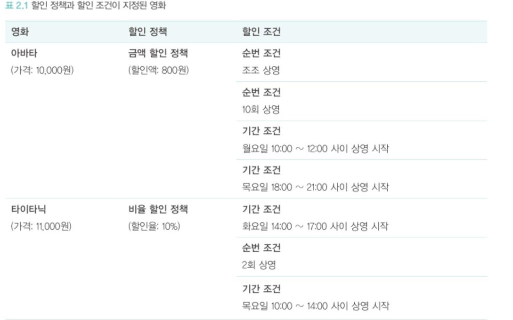
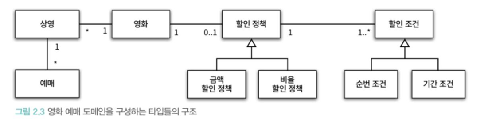
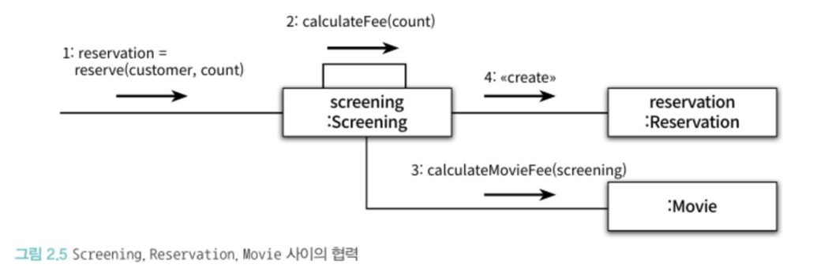
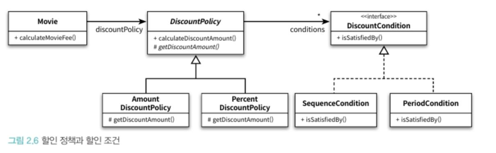

# 설계하기
## 용어 정리
### 영화와 상영
영화 : 영화에 대한 기본 정보  
ex) 제목, 상영시간, 가격

상영 : 관객들이 영화를 관람하는 사건

**사용자가 실제로 에매하는 대상은 영화가 아닌 상영이다.**

### 할인 조건(discount condition)과 할인 정책(discount policy)

**할인 조건은 순서 조건과 기간 조건으로 나뉜다.** 
순서 조건 : 상영 순번을 이용해 할인을 적용  
ex) 영화관에서 매일 n번째로 상영되는 영화를 예매한 고객들에게 할인 혜택 적용

기간 조건 : 영화 상영 시작 시간을 기준으로 특정 시간대에 할인 혜택 적용  
ex) 조조할인, 심야할인

**할인 정책은 할인 요금을 적용한다.**  
고정 할인 정책 : 일정 금액을 할인  
비율 할인 정책 : 구매 가격의 일정 비율을 할인  

할인을 적용하기 위해서는 할인조건과 할인정책을 함께 조합해서 사용한다.  
1. 사용자의 예매정보가 할인조건중 하나라도 만족하는지 검사한다. 
2. 할인조건을 만족할경우 할인정책을 이용해 할인요금을 계산한다.
3. 할인정책은 적용돼 있지만 할인조건을 만족하지 못하는 경우나 아예 할인정책이 적용돼 있지 않은 경우에는 요금을 할인하지 않는다.

### 영화 예매 도메인을 구성하는 개념과 관계

### Screen, Reservation, Movie 사이의 협력

### 할인 정책과 할인 조건

